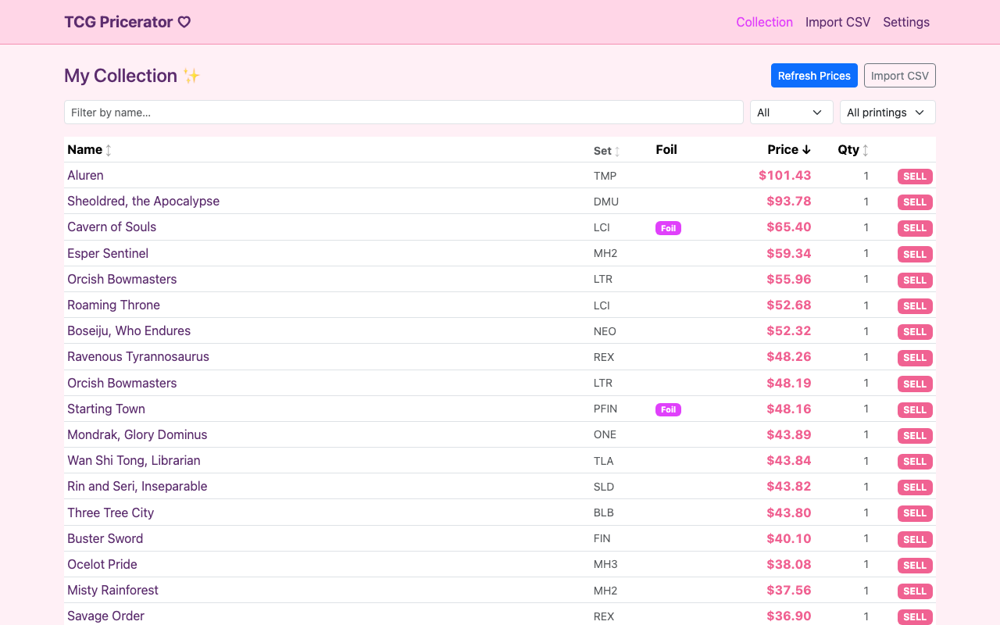
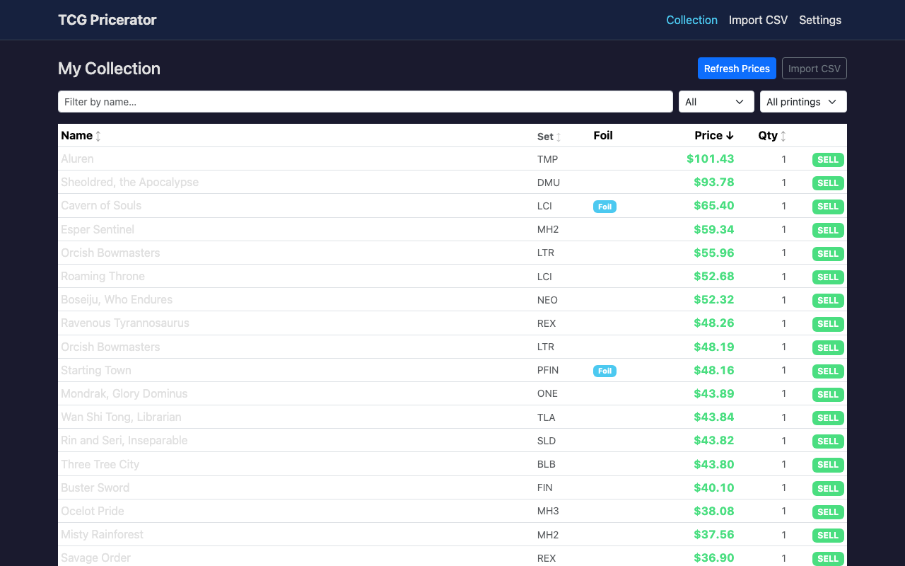
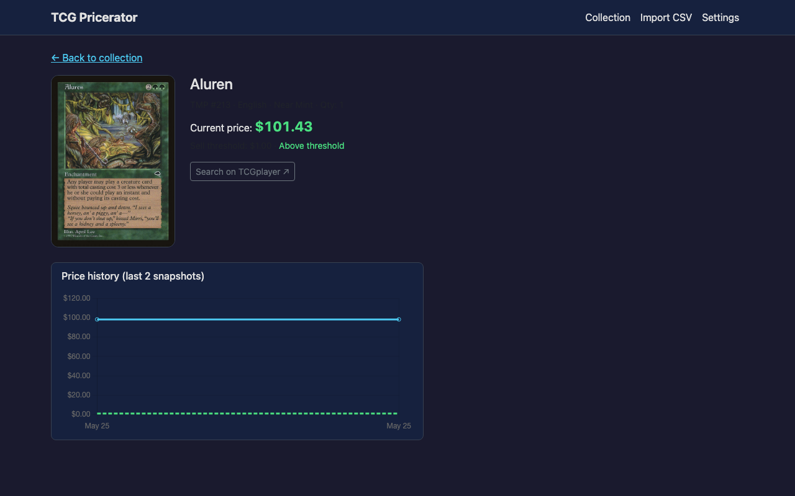

# TCG Pricerator 9000

Local web app that watches your Magic: The Gathering collection and tells you which cards are worth selling. Import a [Moxfield](https://www.moxfield.com/) "haves" CSV, set a price threshold, and get a desktop notification when cards cross it.

Prices come from [Scryfall](https://scryfall.com/), which ingests TCGplayer prices daily.

**No accounts. No cloud. All data lives on your computer.**

---

## Screenshots

**Collection view** — cards sorted by price, highest value at the top. Cards above your sell threshold are highlighted with a SELL badge.



**Dark theme**



**Card detail** — current price, price history chart, and a direct link to search TCGplayer.



---

## Installation

- [Mac](#mac)
- [Windows](#windows)

---

## Mac

### Step 1 — Install Python

1. Open **Safari** and go to [python.org/downloads](https://www.python.org/downloads/)
2. Click the big **Download Python 3.x.x** button
3. Open the downloaded `.pkg` file and follow the installer (click Continue → Agree → Install)
4. When it finishes, open the **Terminal** app (press `⌘ Space`, type `Terminal`, press Enter)
5. Confirm Python installed by typing:
   ```
   python3 --version
   ```
   You should see something like `Python 3.13.1`. If you do, move on.

### Step 2 — Install TCG Pricerator

In Terminal, paste this command and press Enter:

```
pip3 install git+https://github.com/JoshFWS/TCG-Pricerator
```

This downloads and installs the app. It will take about 30 seconds.

### Step 3 — Run it

In Terminal, type:

```
pricerator serve
```

Your browser will open automatically to `http://localhost:5000`. That's the app — you can use it now.

> To stop the app, go back to Terminal and press `Control + C`.

### Step 4 — First use

1. Click **Import CSV** and select your Moxfield export file  
   *(In Moxfield: My Cards → Haves → Export → CSV)*
2. Click **Refresh Prices** — the first refresh downloads ~150 MB of price data from Scryfall, so do it on Wi-Fi. It takes 1–2 minutes.
3. Open **Settings** to set your sell threshold (default is $1.00) and how often to auto-refresh.

### Run automatically at login (optional)

If you want Pricerator to start in the background every time you log in (so it refreshes prices automatically without you having to open Terminal):

1. First, find where `pricerator` is installed by running:
   ```
   which pricerator
   ```
   Copy the path it prints (e.g. `/usr/local/bin/pricerator` or `/Library/Frameworks/Python.framework/Versions/3.13/bin/pricerator`).

2. Open TextEdit, go to **Format → Make Plain Text**, then paste the following. Replace the path in the third `<string>` with the one you copied in step 1:
   ```xml
   <?xml version="1.0" encoding="UTF-8"?>
   <!DOCTYPE plist PUBLIC "-//Apple//DTD PLIST 1.0//EN" "http://www.apple.com/DTDs/PropertyList-1.0.dtd">
   <plist version="1.0">
   <dict>
     <key>Label</key>             <string>com.pricerator</string>
     <key>ProgramArguments</key>
     <array>
       <string>/usr/local/bin/pricerator</string>
       <string>serve</string>
       <string>--no-browser</string>
     </array>
     <key>RunAtLoad</key>         <true/>
     <key>KeepAlive</key>         <true/>
     <key>StandardOutPath</key>   <string>/tmp/pricerator.log</string>
     <key>StandardErrorPath</key> <string>/tmp/pricerator.log</string>
   </dict>
   </plist>
   ```

3. Save the file as `com.pricerator.plist` in `~/Library/LaunchAgents/`  
   *(Press `⌘ Shift G` in the save dialog and type `~/Library/LaunchAgents` to navigate there)*

4. In Terminal, run:
   ```
   launchctl load ~/Library/LaunchAgents/com.pricerator.plist
   ```

5. Done. Pricerator will now start silently at every login. Open your browser and go to `http://localhost:5000` to use it.

---

## Windows

### Step 1 — Install Python

1. Open **Microsoft Edge** or Chrome and go to [python.org/downloads](https://www.python.org/downloads/)
2. Click the big **Download Python 3.x.x** button
3. Open the downloaded `.exe` installer
4. **Important:** On the first screen, check the box that says **"Add python.exe to PATH"** before clicking Install Now

   

5. Click **Install Now** and wait for it to finish, then click Close

### Step 2 — Open Command Prompt

Press `Windows + R`, type `cmd`, and press Enter. A black Command Prompt window opens — you'll use this for the next steps.

### Step 3 — Install TCG Pricerator

In the Command Prompt, paste this command and press Enter:

```
pip install git+https://github.com/JoshFWS/TCG-Pricerator
```

This downloads and installs the app. It will take about 30 seconds.

> **If you see an error saying `pip` is not recognized:** close Command Prompt, restart your computer, then try again.

### Step 4 — Run it

In Command Prompt, type:

```
pricerator serve
```

Your browser will open automatically to `http://localhost:5000`. That's the app.

> To stop the app, click back on the Command Prompt window and press `Ctrl + C`.

### Step 5 — First use

1. Click **Import CSV** and select your Moxfield export file  
   *(In Moxfield: My Cards → Haves → Export → CSV)*
2. Click **Refresh Prices** — the first refresh downloads ~150 MB of price data from Scryfall, so do it on Wi-Fi. It takes 1–2 minutes.
3. Open **Settings** to set your sell threshold (default is $1.00) and how often to auto-refresh.

### Run automatically at login (optional)

If you want Pricerator to start in the background every time you log in:

1. First, find where `pricerator` is installed by running this in Command Prompt:
   ```
   where pricerator
   ```
   Copy the full path it prints (e.g. `C:\Users\YourName\AppData\Local\Programs\Python\Python313\Scripts\pricerator.exe`).

2. Press `Windows + R`, type `taskschd.msc`, press Enter to open **Task Scheduler**

3. In the right panel, click **Create Basic Task…**

4. Give it a name like `TCG Pricerator` and click **Next**

5. For Trigger, select **When I log on** → click **Next**

6. For Action, select **Start a program** → click **Next**

7. In the **Program/script** box, paste the full path you copied in step 1

8. In the **Add arguments** box, type:
   ```
   serve --no-browser
   ```

9. Click **Next**, then **Finish**

10. Done. Pricerator will now start silently at every login. Open your browser and go to `http://localhost:5000` to use it.

---

## Updating

When a new version is released, run this command (same as install) to update:

**Mac:**
```
pip3 install --upgrade git+https://github.com/JoshFWS/TCG-Pricerator
```

**Windows:**
```
pip install --upgrade git+https://github.com/JoshFWS/TCG-Pricerator
```

---

## Features

- Import a Moxfield "haves" CSV (standard, foil, etched, The List `GK1-57` numbers)
- Per-printing thresholds — separate values for nonfoil, foil, and etched
- Automatic background price refresh: 6h / 12h / 24h / Manual
- Desktop notification (Mac + Windows) when cards **newly** cross your threshold  
  *(above→above transitions never re-notify)*
- Card detail screen with 30-snapshot price history chart
- TCGplayer search deep link from each card
- Three themes: **Light**, **Dark**, and **Kawaii** ♡
- Filter and sort your collection by name, set, foil type, price, or quantity

---

## Troubleshooting

**"pricerator is not recognized" / "command not found"**  
Python's Scripts folder isn't in your PATH. On Windows, re-run the Python installer and check "Add python.exe to PATH". On Mac, try `python3 -m pricerator serve` instead.

**The app opens but prices all show —**  
You haven't refreshed yet. Click **Refresh Prices** on the Collection page. The first run takes 1–2 minutes on Wi-Fi.

**Notifications aren't appearing on Mac**  
Go to System Settings → Notifications → scroll down to find Python or Pricerator and make sure notifications are allowed.

**I want to move my data to another computer**  
Copy the `~/.pricerator/` folder (Mac) or `C:\Users\YourName\.pricerator\` (Windows) to the same location on the new machine.

---

## Data location

All data (database + settings) is stored in `~/.pricerator/`.  
Override with the `PRICERATOR_DATA` environment variable.

---

## Privacy

The only network requests are to `api.scryfall.com` and Scryfall's CDN. No analytics, no crash reporters.
